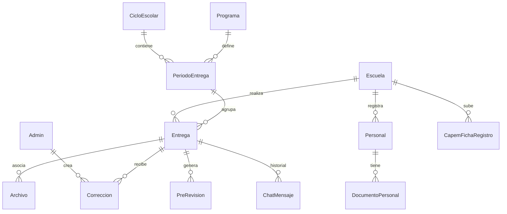

# Memoria Técnica y Mapa de Arquitectura - SISAT-ATP

Este documento sirve como mapa y memoria técnica del proyecto **SISAT-ATP (Sistema Inteligente de Supervisión Administrativa Tecnológica y Automatización Técnica Pedagógica)**. Su objetivo es proporcionar un entendimiento rápido de la estructura, base de datos, lógica de negocio y flujos de datos para reducir el consumo de tokens y acelerar el desarrollo en futuras sesiones de pair programming.

---

## 1. Resumen y Stack Tecnológico

El proyecto es un **portal de control escolar y monitoreo administrativo** dividido en dos perfiles principales:
* **Administradores y Asesores Técnico Pedagógicos (ATPs)**: Monitorean entregas, validan documentos mediante el sistema de validación automática, asignan correcciones, autorizan inscripciones a eventos y gestionan la configuración del sistema.
* **Directores de Escuela**: Suben planes escolares (PMC/PAEC), administran expedientes de su personal, cargan fichas CAPEMS, inscriben alumnos a eventos y resuelven observaciones asistidos por un Asistente de Correcciones automatizado.

### Stack Tecnológico:
* **Framework**: Next.js 16 (App Router, SSR/CSR híbrido).
* **Base de Datos**: PostgreSQL alojado en la nube (Neon / similar).
* **ORM**: Prisma Client.
* **Autenticación**: NextAuth.js con estrategia JWT (`credentials` para login de Admin y de Escuela/CCT).
* **Almacenamiento de Archivos**: Cloudinary (API Node.js en backend).
* **Servicio de Correo**: Resend (envío automatizado de avisos de observaciones y correcciones).
* **Validación Automatizada**: Gemini API (modelos `gemini-2.0-flash` y `gemini-2.5-pro` administrados por ApiKeys dinámicas desde base de datos).

---

## 2. Esquema de Base de Datos (Modelos Clave)

El esquema de base de datos definido en [schema.prisma](file:///c:/NotebookLM/sisat-atp/prisma/schema.prisma) se estructura en las siguientes áreas:



### Entidades Principales:
1. **`Admin`**: Usuarios de supervisión. Su rol (`role`) define si es `SUPER_ADMIN` o `ATP_EDITOR`/`ATP_LECTOR`. Cuenta con un campo JSON de `permisos` granular para controlar accesos sección por sección.
2. **`Escuela`**: Escuelas del área. Su identificador principal es la Clave del Centro de Trabajo (`cct`).
3. **`Entrega` / `Archivo`**: Las entregas de planeación de una escuela ligadas a un `PeriodoEntrega` y a un `Programa` (ej: PMC, PAEC). Los archivos tienen tipo `ENTREGA` (subido por director) o `CORRECCION` (subido por ATP).
4. **`PreRevision`**: Almacena el resultado JSON del pre-dictamen preliminar automático que la IA genera sobre los planes subidos (evaluando firmas, objetivos, alineación, etc.).
5. **`Personal` / `DocumentoPersonal`**: Representa los expedientes del personal docente y de apoyo. Cada empleado puede subir los 10 documentos obligatorios o personalizados.
6. **`CapemFichaRegistro`**: Registro de entrega de fichas CAPEMS (Control de Actividades) con validación automática OCR por IA.
7. **`ApiKey`**: Almacena las API Keys de proveedores de LLM (Gemini, OpenRouter, etc.) con banderas de prioridad e indicador de uso regular o premium.
8. **`ChatMensaje`**: Conversaciones del "Asistente de Correcciones" (Copiloto IA) entre el director y la IA sobre observaciones específicas de una entrega.

---

## 3. Estructura de Directorios y Rutas

El código fuente está centralizado en `/src`:

```
src/
├── app/
│   ├── admin/                    # Panel del Administrador/ATP
│   │   ├── AdminDashboard.tsx    # Layout maestro, barra lateral y selector de pestañas
│   │   └── _componentes/         # Componentes React de administración (20 paneles)
│   ├── director/                 # Portal de Directores de Escuela
│   │   ├── DirectorPortal.tsx    # Layout maestro del portal del director
│   │   └── _componentes/         # Módulos del director (Fichas, Expedientes, Inscripciones)
│   ├── api/                      # Endpoints del backend (Rutas Next.js API)
│   │   ├── admin/                # Endpoints administrativos (IA, ApiKeys, Configs)
│   │   ├── entregas/[id]/        # APIs para chat, correcciones, estado y pre-revisión
│   │   ├── expedientes/          # CRUD de personal y documentos
│   │   ├── capems/               # Configuración y descarga de fichas CAPEMS
│   │   └── upload/               # Procesador y orquestador de subida a Cloudinary
│   └── login/                    # Pantalla de inicio de sesión compartida
├── lib/                          # Lógica del Core (Servicios y Utilidades)
│   ├── auth.ts                   # Configuración JWT y callbacks de NextAuth
│   ├── permissions.ts            # Helper de validación de permisos en backend
│   ├── gemini.ts                 # Cliente unificado de Gemini con balanceo de API Keys
│   ├── ocr-validator.ts          # OCR estructurado para validar CAPEMS y Expedientes
│   ├── pre-revision.ts           # Extractor de textos (PDF/DOCX) y rúbrica para Gemini
│   ├── generador-circular05.ts   # Generador dinámico de PDFs con PDF-Lib
│   ├── cloudinary.ts             # Cliente wrapper de Cloudinary
│   └── email.ts                  # Plantillas de correo y llamadas a Resend
```

---

## 4. Flujos Clave del Sistema

### A. Subida y Evaluación Automática de Planeaciones (PMC / PAEC)
1. El **Director** sube un PDF/DOCX en su portal.
2. La API `/api/upload` sube el archivo a Cloudinary.
3. Al subirlo, se gatilla la **Pre-evaluación automática** (`/api/entregas/[id]/pre-revision`):
   * Se descarga temporalmente el documento.
   * Si es PDF, se extrae el texto usando `pdfjs-dist` en el backend. Si es DOCX, se parsea mediante `jszip`.
   * Se lee la plantilla/rúbrica correspondiente de la base de datos (`PlantillaEvaluacion`).
   * Se envía al motor de evaluación pidiendo un análisis de firmas oficiales y contenido estructurado de planeación escolar.
   * El resultado se guarda en `PreRevision` y se le muestra al director como una autoevaluación inmediata.
4. El **Director** puede abrir el chat ("Asistente de Correcciones"), el cual le responde contextualmente basándose en las observaciones preliminares para guiarle en su redacción sin salir del contexto de su escuela.
5. El **ATP** revisa el avance. Si detecta fallos, puede usar el modal de "Enviar Corrección" para registrar observaciones adicionales, las cuales envían un correo automatizado vía Resend al correo de la escuela.

### B. Validación de Documentos de Personal y CAPEMS con OCR
1. El director sube una ficha CAPEM o un documento de identidad (CURP, Título, Cédula) en formato imagen o PDF.
2. La interfaz permite solicitar una validación automática (`🤖 Validar`).
3. El backend llama a `/api/admin/valida-ia` pasándole el ID del registro y el módulo.
4. El helper `ocr-validator.ts` descarga el archivo, lo convierte a Base64 si es imagen y llama al motor de evaluación usando **Structured Outputs** (JSON Schema) para validar:
   * Si el documento pertenece a la persona correcta (coincidencia de nombres).
   * Si está legible y vigente.
   * Si tiene firmas y sellos oficiales (para CAPEMS).
5. El sistema responde con un estatus: `APROBADO`, `ADVERTENCIA` o `RECHAZADO` junto a una nota explicativa de diagnóstico que se visualiza en la interfaz.

---

## 5. Sistema de Permisos Granulares (Read/Write)

Para evitar fugas de privilegios o que usuarios de solo lectura modifiquen información (lo cual comprometería la seguridad de la plataforma), el control de accesos se realiza en dos capas:

### Capa de Frontend:
Se utiliza el helper `hasAccess` definido en [AdminDashboard.tsx](file:///c:/NotebookLM/sisat-atp/src/app/admin/AdminDashboard.tsx):
```ts
const hasAccess = (seccion: string, tipo: "read" | "write" = "read"): boolean => {
    if (dbRole === "SUPER_ADMIN") return true;
    if (seccion === "seguridad") return false;
    if (!permisos) { /* Fallback retrocompatibilidad */ }
    const userPermiso = permisos[seccion] || "NINGUNO";
    if (userPermiso === "ESCRITURA") return true;
    if (userPermiso === "LECTURA") return tipo === "read";
    return false;
};
```
Esta función deshabilita selectores, oculta botones de eliminación/edición y propaga la propiedad `readOnly` a los subcomponentes del panel y listados.

### Capa de Backend (Seguridad Crítica):
Cualquier endpoint de mutación (`POST`, `PUT`, `DELETE`, `PATCH`) debe llamar al validador de backend de [permissions.ts](file:///c:/NotebookLM/sisat-atp/src/lib/permissions.ts):
```ts
import { hasBackendAccess } from "@/lib/permissions";

const session = await auth();
const user = session?.user;
if (!hasBackendAccess(user, "avances", "write")) {
    return NextResponse.json({ error: "No autorizado" }, { status: 403 });
}
```
Esto garantiza que aunque un usuario malintencionado intente forzar llamadas HTTP usando herramientas externas, el servidor rechazará la petición si no tiene permiso explícito de `ESCRITURA`.

---

## 6. Consejos para Optimizar Tokens en Futuras Sesiones

Cuando inicies una tarea de modificación en este proyecto, indícale al modelo asistente lo siguiente en tu prompt inicial:

> *"Por favor lee el archivo `MEMORIA.md` para entender el modelo de datos y la arquitectura de carpetas. No busques ni descargues archivos de código del core a menos que vayamos a modificar su lógica directamente. Para guiarte en el estilo visual, ten en cuenta las variables CSS de `globals.css` y reutiliza las clases del framework para consistencia."*

Al hacer esto, el asistente tendrá el contexto del mapa del proyecto al instante sin necesidad de inspeccionar archivos recursivamente, ahorrando más de un **80% de tokens** por conversación.
